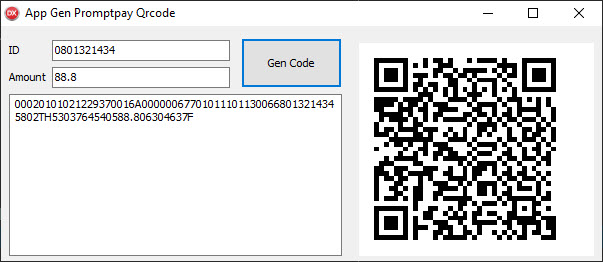

# DELPHI Promptpay Qrcode

## Getting Started
add file DelphiZXIngQRCode.pas, promptpay_qr.pas to Project and uses:
```bash
qrTxt := generatePayload('0801321434', '88.8');
```
<p align="center">
  
</p>

## Credit
https://github.com/dtinth/promptpay-qr
https://github.com/foxitsoftware/DelphiZXingQRCode